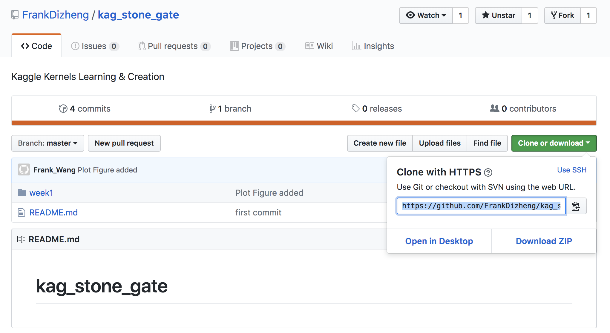
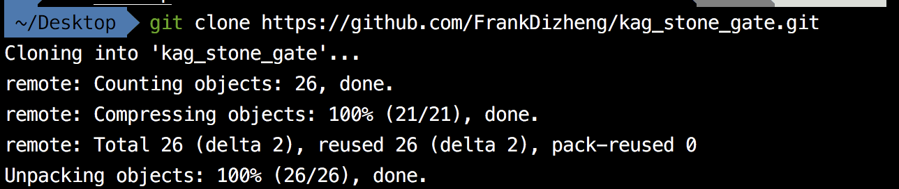
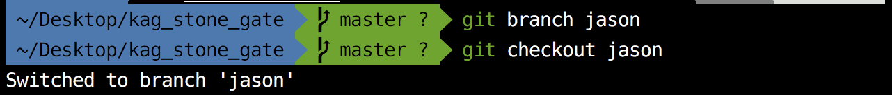
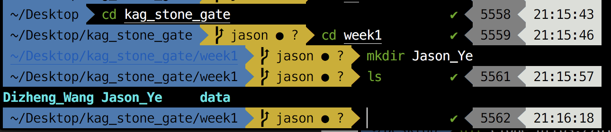
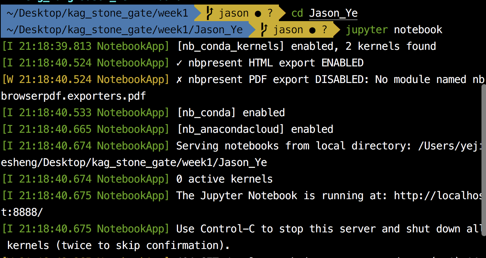
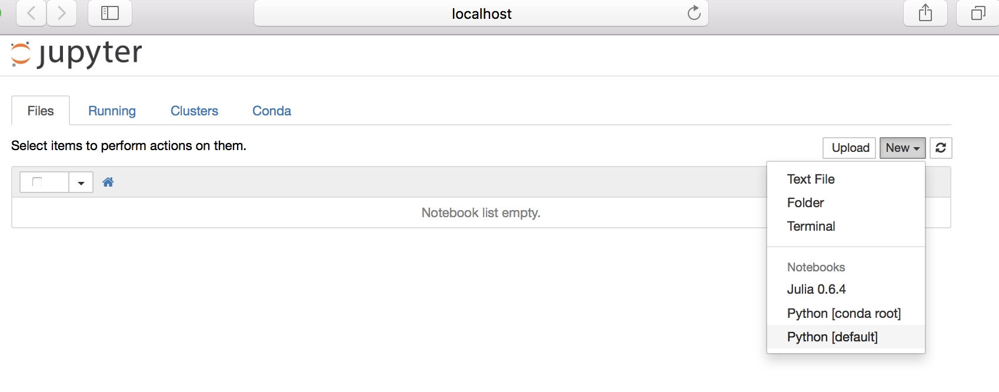
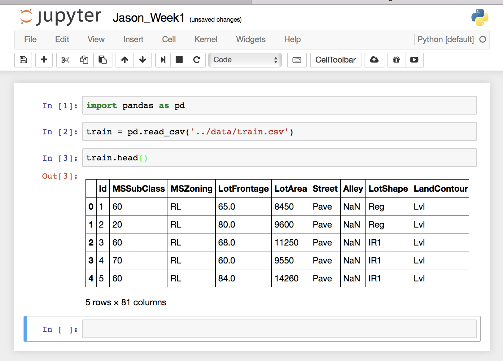

# kag_stone_gate

## 简介
	
这是我们组建的kaggle兴趣小组的Githup，目的是为了组织大家一起学习、一起成长，最终进行kaggle比赛，获取奖杯（吃鸡吃鸡）。

目前目录情况：

1.	week1（周数，以后会依次递增）
	- Dizheng_Wang（个人工作目录）
	- data（该周对应数据）
	
2. README.md（使用说明）
3. image(放置使用说明相关图片）

## Usage

主页：https://github.com/FrankDizheng/kag_stone_gate

### 第一步：

clone到本地：

如上图获取到web URL：https://github.com/FrankDizheng/kag_stone_gate.git

然后采用Git（需先安装该命令，自行谷歌即可获取安装方法）

### 第二步：

创建自己的分支和切换到自己的分支下工作：

解释：上图中我创建了jason分支并切换到该分支下

在对应周数下创建自己的目录：

### 第三步：

进行对应的学习和工作

1. 	启动jupyter
	
	
	
2. 创建notebook

3. 读取对应周数数据并进行分析学习

### 第四步：

将对应工作提交到自己分支上

1.	git add *
2. git commit -m "update content"
3. git pull
4. git push origin branch_name

	

